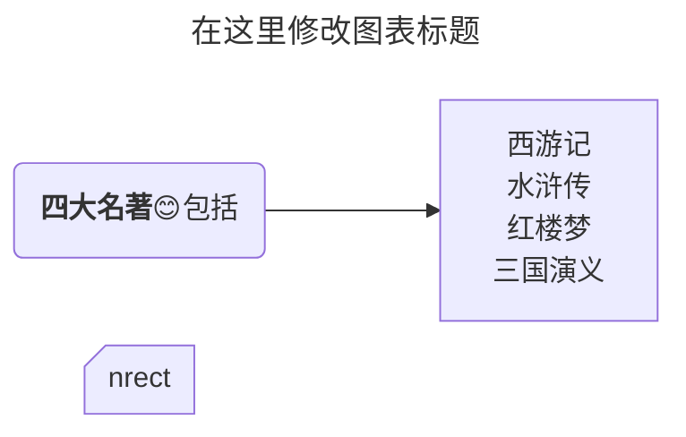
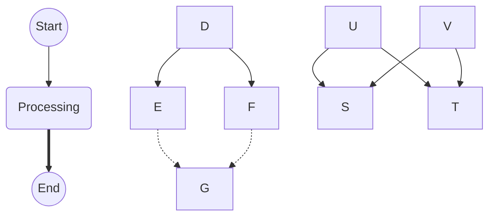
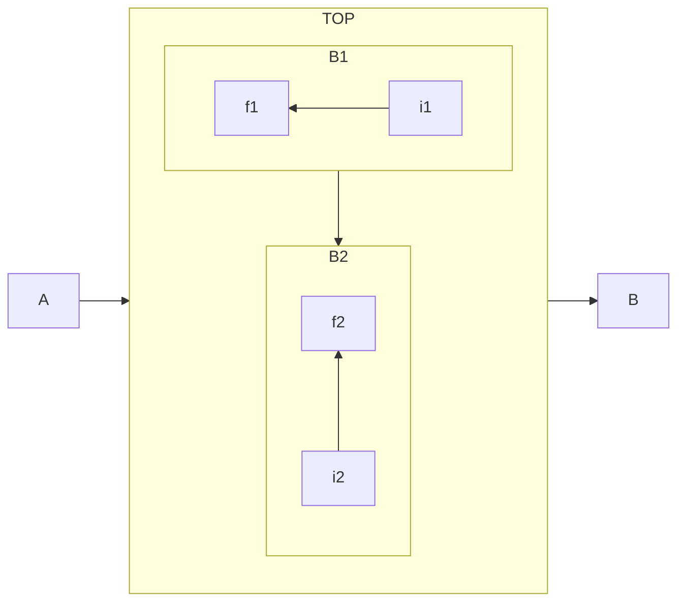
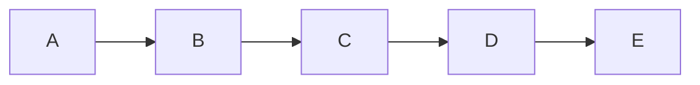
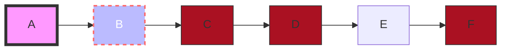
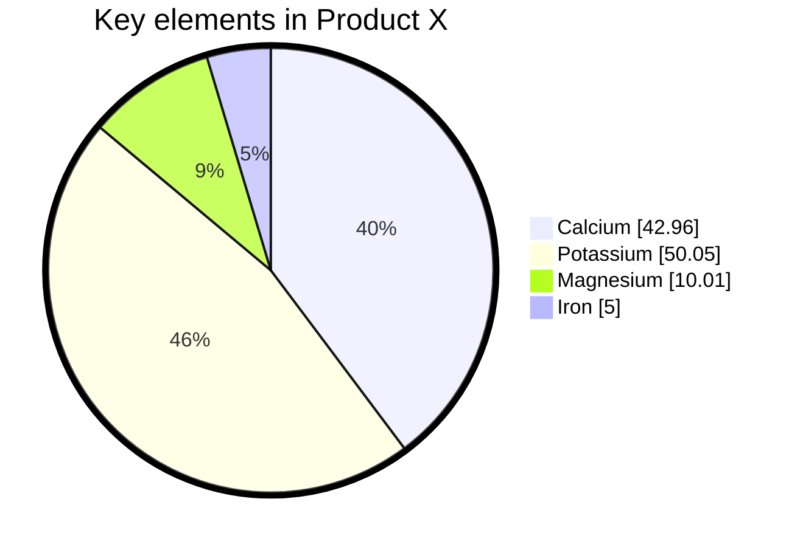

> 在 chirpy 的帖子中，需要在设置部分加入 `mermaid: true` 才能开启 mermaid 支持
{: .prompt-tip }

> chirpy 当前的 mermaid 版本为 v11.4.0，有些新语法特性不支持
{: .prompt-warning }

## 基本语法
### 注释
mermaid 使用 `%%` 进行行注释
### Frontformatter

```yaml
---
title: Frontmatter Example
displayMode: compact
config:
  layout: elk
  look: handDrawn
  theme: forest
gantt:
    useWidth: 400
    comp
```
## 流程图 flowchart



### 图表方向
可取值包括 `LR` `RL` `TB` `BT`

### 节点内文本
+ 如果文本包含 Unicode 字符，要用`"` 包含起来
+ 如果包含有  markdown 文本，需要用 `"\\`` 包含

### 节点形状
#### 基本节点形状

|   符号    |    形状    |  符号   |      形状      |
| :-------: | :--------: | :-----: | :------------: |
|   `[ ]`   |    矩形    |  `( )`  |    圆角矩形    |
|  `([ ])`  |  圆角矩形  | `[[ ]]` |   双竖线矩形   |
|  `[( )]`  |   圆柱形   | `(( ))` |      圆形      |
|  `[/ /]`  | 平行四边形 | `[\ \]` | 反向平行四边形 |
|  `[/ \]`  |    梯形    | `[\ /]` |      梯形      |
| `((( )))` |   同心圆   | `[\ /]` |      梯形      |

#### 扩展节点形状

> mermaid v11.3.0+ 引入，语法格式为 `nodeName@{ shape: rect,label:"content"}`
{: .prompt-tip }

|           Semantic Name           |       Shape Name       | Short Name |          Description           |                     Alias Supported                      |
| :-------------------------------: | :--------------------: | :--------: | :----------------------------: | :------------------------------------------------------: |
|               Card                |   Notched Rectangle    | notch-rect |       Represents a card        |                 card, notched-rectangle                  |
|              Collate              |       Hourglass        | hourglass  | Represents a collate operation |                    collate, hourglass                    |
|             Com Link              |     Lightning Bolt     |    bolt    |       Communication link       |                 com-link, lightning-bolt                 |
|              Comment              |      Curly Brace       |   brace    |         Adds a comment         |                     brace-l, comment                     |
|           Comment Right           |      Curly Brace       |  brace-r   |         Adds a comment         |                                                          |
| Comment with braces on both sides |      Curly Braces      |   braces   |         Adds a comment         |                                                          |
|         Data Input/Output         |       Lean Right       |   lean-r   |   Represents input or output   |                    in-out, lean-right                    |
|         Data Input/Output         |       Lean Left        |   lean-l   |   Represents output or input   |                    lean-left, out-in                     |
|             Database              |        Cylinder        |    cyl     |        Database storage        |                  cylinder, database, db                  |
|             Decision              |        Diamond         |    diam    |      Decision-making step      |               decision, diamond, question                |
|               Delay               | Half-Rounded Rectangle |   delay    |       Represents a delay       |                  half-rounded-rectangle                  |
|       Direct Access Storage       |  Horizontal Cylinder   |   h-cyl    |     Direct access storage      |                 das, horizontal-cylinder                 |
|           Disk Storage            |     Lined Cylinder     |  lin-cyl   |          Disk storage          |                   disk, lined-cylinder                   |
|              Display              |    Curved Trapezoid    | curv-trap  |      Represents a display      |                curved-trapezoid, display                 |
|          Divided Process          |   Divided Rectangle    |  div-rect  |     Divided process shape      |       div-proc, divided-process, divided-rectangle       |
|             Document              |        Document        |    doc     |     Represents a document      |                      doc, document                       |
|               Event               |   Rounded Rectangle    |  rounded   |      Represents an event       |                          event                           |
|              Extract              |        Triangle        |    tri     |       Extraction process       |                    extract, triangle                     |
|             Fork/Join             |    Filled Rectangle    |    fork    |  Fork or join in process flow  |                           join                           |
|         Internal Storage          |      Window Pane       |  win-pane  |        Internal storage        |              internal-storage, window-pane               |
|             Junction              |     Filled Circle      |   f-circ   |         Junction point         |                 filled-circle, junction                  |
|          Lined Document           |     Lined Document     |  lin-doc   |         Lined document         |                      lined-document                      |
|       Lined/Shaded Process        |    Lined Rectangle     |  lin-rect  |      Lined process shape       | lin-proc, lined-process, lined-rectangle, shaded-process |
|            Loop Limit             |  Trapezoidal Pentagon  | notch-pent |        Loop limit step         |               loop-limit, notched-pentagon               |
|            Manual File            |    Flipped Triangle    |  flip-tri  |     Manual file operation      |              flipped-triangle, manual-file               |
|           Manual Input            |    Sloped Rectangle    |  sl-rect   |       Manual input step        |              manual-input, sloped-rectangle              |
|         Manual Operation          |   Trapezoid Base Top   |   trap-t   |    Represents a manual task    |           inv-trapezoid, manual, trapezoid-top           |
|          Multi-Document           |    Stacked Document    |    docs    |       Multiple documents       |           documents, st-doc, stacked-document            |
|           Multi-Process           |   Stacked Rectangle    |  st-rect   |       Multiple processes       |           processes, procs, stacked-rectangle            |
|                Odd                |          Odd           |    odd     |           Odd shape            |                                                          |
|            Paper Tape             |          Flag          |    flag    |           Paper tape           |                        paper-tape                        |
|        Prepare Conditional        |        Hexagon         |    hex     | Preparation or condition step  |                     hexagon, prepare                     |
|          Priority Action          | Trapezoid Base Bottom  |   trap-b   |        Priority action         |          priority, trapezoid, trapezoid-bottom           |
|              Process              |       Rectangle        |    rect    |     Standard process shape     |                 proc, process, rectangle                 |
|               Start               |         Circle         |   circle   |         Starting point         |                           circ                           |
|               Start               |      Small Circle      |  sm-circ   |      Small starting point      |                   small-circle, start                    |
|               Stop                |     Double Circle      |  dbl-circ  |    Represents a stop point     |                      double-circle                       |
|               Stop                |     Framed Circle      |  fr-circ   |           Stop point           |                   framed-circle, stop                    |
|            Stored Data            |   Bow Tie Rectangle    |  bow-rect  |          Stored data           |              bow-tie-rectangle, stored-data              |
|            Subprocess             |    Framed Rectangle    |  fr-rect   |           Subprocess           |    framed-rectangle, subproc, subprocess, subroutine     |
|              Summary              |     Crossed Circle     | cross-circ |            Summary             |                 crossed-circle, summary                  |
|          Tagged Document          |    Tagged Document     |  tag-doc   |        Tagged document         |                 tag-doc, tagged-document                 |
|          Tagged Process           |    Tagged Rectangle    |  tag-rect  |         Tagged process         |        tag-proc, tagged-process, tagged-rectangle        |
|          Terminal Point           |        Stadium         |  stadium   |         Terminal point         |                      pill, terminal                      |
|            Text Block             |       Text Block       |    text    |           Text block           |                                                          |

#### 图标 icon
> 要使用图标，需要先注册图标包。按照[添加自定义图标](https://mermaid.nodejs.cn/config/icons.html)中的说明进行操作。
{: .prompt-tip }


#### 图像 image

```
A@{ img: "url_to_image", label: "Image Label", pos: "t", w: 60, h: 60, constraint: "off" }
```

### 链接线



#### 链接线形状

|     符号     |     样式     |     符号      |       样式       |
| :----------: | :----------: | :-----------: | :--------------: |
|    `---`     |     直线     |     `-.-`     |       虚线       |
|    `===`     |    粗直线    |     `~~~`     |     隐藏的线     |
|    `-->`     |    右箭头    |     `--x`     |   右端点为叉号   |
|    `--o`     | 右端点为圆形 |               |                  |
| `-- text --` |  带文字直线  | `-- text -->` | 带文字和箭头直线 |

#### 指定链接线 ID
> 在链接线后指定名称并以 `@` 结尾（经测试，chirpy 中的 mermaid v11.4.0 不支持此功能）
{: .prompt-tip }

```
flowchart LR
  A e1@---> B
  e1@{ animate: true }
```

## 子图



## 交互
### 单击打开链接

```
click nodeId callback
click nodeId call callback()
```

> 将测试，Chrome 浏览器下不能弹出窗口
{: .prompt-tip }



## 样式类
### 定义样式类

```
classDef className fill:#e0e,stroke:#333,stroke-width:4px;
```

### 附着样式类
在节点名称后使用 `:::` 符号，也可使用 `class` 关键字

### 样式类案例

```text
flowchart LR
  %% nodeName:::className 可以为节点指定 class
  A --> B --> C --> D --> E --> F:::myNodeClass
  linkStyle 1,3 color:red;
  style A fill:#f9f,stroke:#333,stroke-width:4px
  style B fill:#bbf,stroke:#f66,stroke-width:2px,color:#fff,stroke-dasharray: 5 5

  %% 定义节点类
  classDef myNodeClass fill:#a12,stroke:#333,stroke-width:1px,round:2px
  %% 为节点附着类
  class C,D myNodeClass;
```



## 饼图



## 在线资源
+ [mermaid 中文网](https://mermaid.nodejs.cn/intro/syntax-reference.html)
+ [mermaid 在线编辑器](https://mermaid-live.nodejs.cn/edit)
